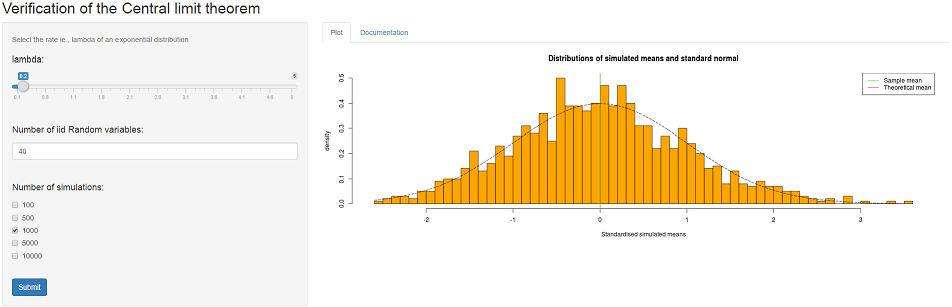

## Summary

* The aim of this application is to verify the Central limit theorem using the exponential distribution. 
* In this project, the exponential distribution is obtained by averaging a few exponential random variables as inputted   in the side bar panel. 
* The distribution is standardised(centered and scaled) to investigate the Central limit theorem. 
* The iid random variables are drawn from a exponential distribution  with the rate lambda. 
* According to the Central limit theorem, the distribution of the averages of iid variables(properly standardised)       becomes that of a standard normal as the sample size increases. 

--- .class #id 

## Layout



--- .class #id 

## Example case

```{r echo=TRUE}
# simulating 1000 RVs where each one is obtained by averaging 40 exponential random variables
set.seed(24)
lambda <- 0.2 # rate of the exponential distribution
n <- 40 # number of iid RVs
ns <- 1000 # number of simulations
simulated_means <- numeric(ns)
for (i in 1:ns) {  simulated_means[i] = mean(rexp(n = n,rate = lambda))}
# Calculation of sample mean and theoretical mean
sample_mean <- mean(simulated_means);theoretical_mean <- 1/lambda;sample_sd <- sd(simulated_means)
sample_mean
theoretical_mean

```

--- .class #id 

## Example (cont...)

```{r echo=FALSE}
simulated_std_means <- (simulated_means-sample_mean)/sample_sd
xfit <- seq(min(simulated_std_means), max(simulated_std_means), length=100)
yfit <- dnorm(xfit, mean=0, sd=1)
```

```{r echo=TRUE}
hist(simulated_std_means,breaks=50,prob=T,col="orange",xlab = "Standardised simulated means",main="Distributions of simulated means and standard normal",ylab="density");abline(v=0,col = "red",lty=1)
abline(v=mean(simulated_std_means),col = "green",lty=1);lines(xfit, yfit, pch=22, col="black", lty=5);legend("topright",legend = c("Sample mean","Theoretical mean"),col = c("green","red"), lty=1)
```

